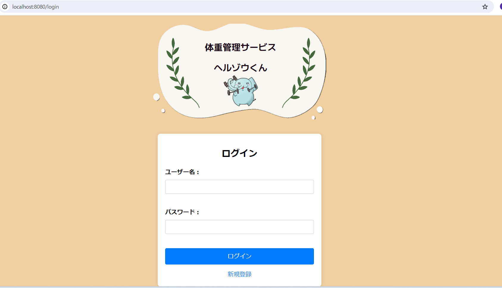
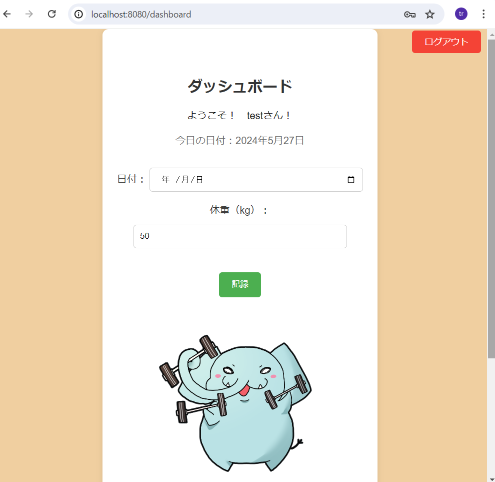
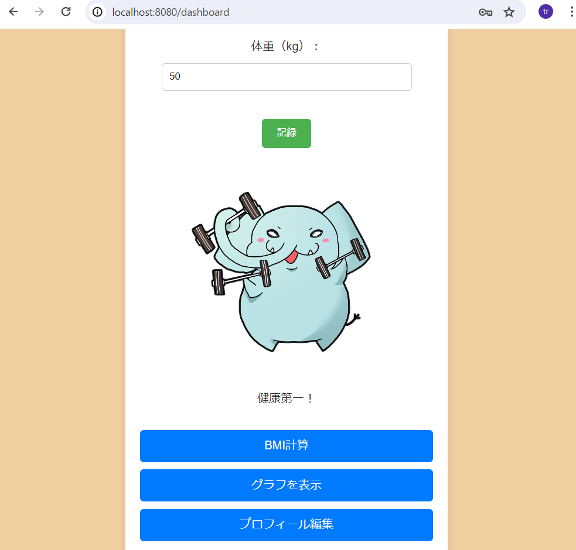
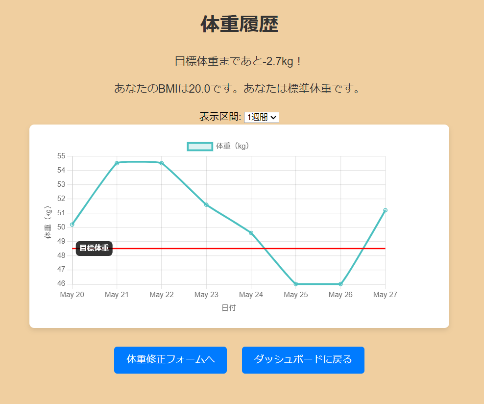

# MyProject
# 体重管理アプリケーション　ヘルゾウくん

このアプリケーションは、ユーザーが体重を管理しやすくするための体重管理アプリケーションです。毎日の体重を記録し、グラフで体重の推移を視覚化したり、目標体重を設定したり、BMI（ボディマス指数）を計算して健康に関するフィードバックを提供する機能があります。

## 主な機能
- ユーザー登録と認証
- 体重記録
- 体重履歴の視覚化
- 目標体重の追跡
- BMI計算とフィードバック
- プロフィール管理
- アカウント削除機能
  
## スクリーンショット
ログイン画面


ダッシュボード



体重履歴


# データベースの設定
以下のSQLスクリプトを使用して、データベースと必要なテーブルを作成します。
## データベースの設定

以下のSQLスクリプトを使用して、データベースと必要なテーブルを作成します。

```sql
CREATE DATABASE weight_tracker;

USE weight_tracker;

CREATE TABLE users (
    id BIGINT AUTO_INCREMENT PRIMARY KEY,
    username VARCHAR(255) NOT NULL UNIQUE,
    password VARCHAR(255) NOT NULL,
    role VARCHAR(255) NOT NULL
);

CREATE TABLE user_profiles (
    id BIGINT AUTO_INCREMENT PRIMARY KEY,
    user_id BIGINT NOT NULL,
    goal_weight DOUBLE NOT NULL,
    height DOUBLE NOT NULL,
    birth_date DATE NOT NULL,
    FOREIGN KEY (user_id) REFERENCES users(id)
);

CREATE TABLE weight_records (
    id BIGINT AUTO_INCREMENT PRIMARY KEY,
    user_id BIGINT NOT NULL,
    date DATE NOT NULL,
    weight FLOAT NOT NULL,
    FOREIGN KEY (user_id) REFERENCES users(id)
);


## インストール手順
1. リポジトリをクローンします:
   git clone https://github.com/ShioriYasuda/MyProject.git
   cd MyProject

2. 必要な依存関係をインストールします（Gradleを使用）:
./gradlew build

3. データベースを設定します:
src/main/resources/application.properties ファイルを編集して、以下のようにデータベースの設定を行います:

4. application.propertiesでデータベースの設定を行います
spring.datasource.url=jdbc:mysql://localhost:3306/your_database_name
spring.datasource.username=your_username
spring.datasource.password=your_password

5. アプリケーションをビルドして実行します:
./gradlew bootRun

6. 以下のURLにアクセスします
http://localhost:8080/login

# 使用技術
- フロントエンド: HTML, CSS, JavaScript (Chart.js)
- バックエンド: Java, Spring Boot
- データベース: MySQL
- ビルドツール: Gradle
- バージョン管理: Git

# ライセンス
このプロジェクトはMITライセンスの下でライセンスされています - 詳細についてはLICENSEファイルを参照してください。

# コンタクト

名前: Shiori Yasuda
GitHub: https://github.com/ShioriYasuda

